<div align="center">
  

  <p><strong>Follow the money. Find the fraud. Prove it.</strong></p>
  <p>An evidence-first AI workspace that turns messy audit dossiers into traceable findings, cited relationships, and source-level proof.</p>

  <p>
    
    
    
    
    
  </p>
</div>

---

## The problem we wanted to solve

AI can read a company dossier and declare *“fraud”* in seconds. In a real audit, that answer is useless unless an auditor can verify exactly how it was reached.

Audit teams work across PDFs, spreadsheets, exports, contracts, confirmations, invoices, and scanned evidence. The important contradiction is rarely contained in one file. It appears between files: the ledger disagrees with the bank confirmation, two supposedly independent suppliers share an account, or a payment predates the document that authorized it.

At the same time, false positives are expensive. A discrepancy may come from foreign exchange, cut-off timing, VAT treatment, partial delivery, or a credit note. An investigation tool therefore needs more than pattern recognition—it needs provenance, adversarial reasoning, and a human review path.

This is the broader problem space in which [Cortea](https://www.cortea.ai/de) works: AI-assisted audit quality, consistency checks, traceable evidence, and workflows where auditors retain control over conclusions. 

## Our answer

> **The model proposes. The system verifies. The auditor decides.**

CorteX converts an uploaded folder hierarchy into an interactive investigation workspace. It analyzes the dossier with GPT-5.6, rejects claims whose quotations cannot be resolved to an uploaded source, and presents surviving findings through a cited entity graph and review workflow.

The primary journey is deliberately simple:

```text
Suspicious relationship
        ↓
Ranked finding
        ↓
Reasoning and contradiction chain
        ↓
Exact source document and passage
        ↓
Auditor confirms, rejects, or requests review
```

## The pipeline

```mermaid
flowchart TB
    subgraph INPUT[1 · Evidence intake]
        direction LR
        PDF[PDF documents]
        TAB[CSV · XLSX · GDPdU]
        DOC[DOCX · TXT · XML]
        TREE[Nested folder hierarchy]
        PDF --> TREE
        TAB --> TREE
        DOC --> TREE
    end

    subgraph INGEST[2 · Generic ingestion and provenance]
        direction LR
        DISCOVER[Discover files and preserve paths]
        PARSE[Extract readable document content]
        MANIFEST[Build evidence manifest]
        BATCH[Create bounded evidence batches]
        DISCOVER --> PARSE --> MANIFEST --> BATCH
    end

    TREE --> DISCOVER

    subgraph EVIDENCE[3 · Parallel GPT-5.6 evidence analysis]
        direction LR
        EA1[Evidence agent 1]
        EA2[Evidence agent 2]
        EAN[Evidence agent N]
        OBS[Cited observations<br/>facts · entities · controls · anomalies]
        EA1 --> OBS
        EA2 --> OBS
        EAN --> OBS
    end

    BATCH --> EA1
    BATCH --> EA2
    BATCH --> EAN

    subgraph SYNTHESIS[4 · Cross-document synthesis]
        direction LR
        LINK[Link observations across files]
        RECON[Reconcile balances and relationships]
        CAND[Generate candidate findings]
        LINK --> RECON --> CAND
    end

    MANIFEST --> LINK
    OBS --> LINK

    subgraph TRIAGE[5 · Adversarial triage · three LLM roles]
        direction LR
        P[Prosecutor<br/>Minimal contradiction set<br/>Materiality estimate]
        X[Defense<br/>Cut-off · VAT · FX · credits<br/>Translation · clerical error]
        J[Judge<br/>Require cited refutation<br/>Neutral audit conclusion]
        P --> X --> J
    end

    CAND --> P
    J --> DECISION{Triage decision}
    DECISION -->|Supported and defenses refuted| FINDING[Verified finding]
    DECISION -->|Concern remains unresolved| REVIEW[Observation for review]
    DECISION -->|Innocent explanation supported| CLEARED[Cleared item]

    subgraph GATE[6 · Deterministic verification and attestation]
        direction LR
        PATH[Resolve exact source path]
        QUOTE[Match verbatim quotation]
        MONEY[Validate supported amounts and currency]
        DEDUPE[Prevent overlapping double-counting]
        ATTEST[Verify GPT-5.6 response IDs<br/>model and token attestation]
        PATH --> QUOTE --> MONEY --> DEDUPE --> ATTEST
    end

    FINDING --> PATH
    REVIEW --> PATH
    CLEARED --> PATH
    MANIFEST -. original source content .-> PATH

    ATTEST --> VERIFIED{Passes every gate?}
    VERIFIED -->|No| REJECT[Discard unsupported claim]
    VERIFIED -->|Yes| REPORT[Attested investigation report]

    subgraph API[7 · Evidence API]
        direction LR
        GRAPH[Backend entity graph<br/>entities · accounts · relationships]
        RANK[Ranked findings and observations]
        SOURCES[Documents · pages · source passages]
        STATUS[Live processing stages]
    end

    REPORT --> GRAPH
    REPORT --> RANK
    REPORT --> SOURCES
    EVIDENCE -. progress .-> STATUS
    TRIAGE -. progress .-> STATUS

    subgraph UI[8 · Auditor workspace]
        direction LR
        EXPLORE[Explore graph and risk paths]
        REASON[Inspect reasoning and contradiction chain]
        PROOF[Open exact supporting evidence]
        HUMAN[Confirm · reject · needs review]
        EXPLORE --> REASON --> PROOF --> HUMAN
    end

    GRAPH --> EXPLORE
    RANK --> REASON
    SOURCES --> PROOF
    STATUS --> EXPLORE
    HUMAN -. human judgment remains final .-> REPORT

    classDef ai fill:#eeeaff,stroke:#6c5ce7,color:#211b45
    classDef verify fill:#e9f7f1,stroke:#2f8f68,color:#183e30
    classDef risk fill:#fff0ed,stroke:#c65f4b,color:#5b241b
    class EA1,EA2,EAN,P,X,J ai
    class PATH,QUOTE,MONEY,DEDUPE,ATTEST,VERIFIED verify
    class CAND,FINDING,REVIEW,REJECT risk
```



### 1. Generic ingestion

CorteX preserves nested folder structures and reads common audit evidence formats including PDF, CSV, XLSX, DOCX, TXT, XML, and GDPdU-style exports. No sample-company names, expected fraud labels, or dossier-specific conclusions are hardcoded into the pipeline.

### 2. Evidence analysis

Readable evidence is divided into bounded batches and analyzed concurrently with GPT-5.6. The model identifies facts, relationships, control failures, contradictions, and unusual transactions while retaining the supporting source filename and verbatim quotation.

### 3. Cross-document candidate generation

The dossier-level pass combines observations across documents and proposes candidate findings. This is where deeper schemes emerge: shared identifiers, inconsistent balances, suspicious timing, related parties, or evidence that does not reconcile across independent sources. A candidate is not yet a finding—it must survive adversarial triage.

### 4. Adversarial triage: prosecutor, defense, judge

False positives matter. An innocent discrepancy must not be presented as proven fraud, so every candidate becomes a small trial between three adversarial LLM roles:

#### Prosecutor

The prosecutor assembles the **minimal contradiction set**: the smallest collection of cited passages that cannot all be true simultaneously. It states the suspected issue in neutral audit language and estimates its supported monetary or materiality effect without double-counting overlapping concerns.

#### Defense

The defense receives the same evidence and actively tries to defeat the allegation. It searches for plausible explanations such as:

- Timing and cut-off differences
- VAT-inclusive versus VAT-exclusive amounts
- Partial deliveries and credit notes
- Foreign-exchange effects
- Transposed digits or clerical mistakes
- Translation and terminology differences
- Missing but potentially legitimate supporting documents

#### Judge

The judge promotes a candidate only when the evidence supports the allegation **and** the defense explanations are refuted with citations. The outcome is deliberately tiered:

| Outcome | Meaning |
|---|---|
| **Finding** | The contradiction and its refutation chain are supported by cited evidence |
| **Observation for review** | A concern remains, but at least one innocent explanation is still plausible |
| **Cleared item** | The discrepancy is explained or refuted by the available evidence |

This structure matches the asymmetric risk of forensic auditing: CorteX aims for high-precision findings and is explicit about uncertainty instead of labeling every anomaly as fraud. The three roles are orchestrated inside the GPT-5.6 judgment stage and returned as a structured `triage` record containing `prosecutor`, `defense`, and `judge` reasoning.

### 5. Deterministic verification gate

Every proposed citation is checked against the original uploaded content. A finding without verified inculpatory evidence is discarded. The backend does not manufacture placeholder citations or silently publish an offline fallback report.

### 6. Auditor workspace

Verified output becomes:

- An explorable backend-generated entity graph
- Ranked findings and observations
- Minimal contradiction sets
- Linked source passages
- Human confirm, reject, and needs-review controls
- A live investigation journey showing actual backend stages

## What makes CorteX different

| Principle | How CorteX applies it |
|---|---|
| No number without a source | Financial claims retain supporting evidence and citations |
| No black-box verdict | Findings expose their narrative, evidence, and linked graph path |
| No silent fallback | Investigations require successful GPT-5.6 processing and attestation |
| No synthetic proof | Unresolvable quotations are removed before findings reach the UI |
| No automatic conviction | The auditor remains responsible for the final review decision |
| No flattened dossier | Uploaded subfolders and relative paths are preserved |

## Product experience

### Folder-native evidence intake

Drop one or multiple audit folders into the browser. CorteX preserves their hierarchy, calculates file and folder sizes, caches the browser selection locally, and lets auditors inspect individual files before starting an investigation.

### Live investigation

The workspace streams real backend stages—evidence reading, concurrent GPT batches, synthesis, and quote verification—while a responsive activity flow explains the work currently happening.

### Graph-driven investigation

The frontend renders the graph returned by FastAPI. Backend data controls the entities, relationships, risks, citations, linked findings, and explanations; React Flow only handles layout and interaction.

### Evidence-level review

Selecting a citation opens the underlying backend document. Text evidence is highlighted directly, while PDFs open at the cited page.

## Architecture

```text
CorteX/
├── frontend/                 React + TypeScript + Vite auditor workspace
│   ├── public/cortex.png     Project logo
│   └── src/                  Upload, documents, graph, findings, evidence UI
├── backend/                  FastAPI + GPT-5.6 forensic pipeline
│   ├── auditpipe/            Ingestion, LLM, verification, API adapters
│   ├── prompts/              Evidence-analysis and synthesis prompts
│   └── runtime/              Local uploaded dossiers and generated reports
├── openapi.yaml              Shared frontend/backend API contract
└── package.json              Root development commands
```

## Technology

**Frontend:** React, TypeScript, Vite, TanStack Query, React Flow, Lucide, PDF/browser previews.

**Backend:** Python, FastAPI, OpenAI Responses API, Pydantic, PyPDF, OpenPyXL, python-docx.

**Model:** GPT-5.6 with recorded response IDs, returned model identifiers, and token usage in the report attestation.

## Run locally

### 1. Install

```bash
npm --prefix frontend install

cd backend
python3 -m venv .venv
.venv/bin/pip install -e .
cd ..
```

### 2. Configure the backend

Create `backend/.env`:

```env
OPENAI_API_KEY=your_openai_api_key

# Optional tuning
AUDIT_REASONING_EFFORT=medium
AUDIT_PARALLEL_BATCHES=4
AUDIT_REQUEST_TIMEOUT_SECONDS=600
```

Create `frontend/.env.local`:

```env
VITE_USE_LLM=true
```

`OPENAI_API_KEY` must remain in the backend. Never expose it through a `VITE_` variable.

### 3. Start both services

Open two terminals from the repository root:

```bash
# Terminal 1 — FastAPI on http://127.0.0.1:8000
npm run dev:backend
```

```bash
# Terminal 2 — Vite on http://localhost:5173
npm run dev:frontend
```

Vite proxies `/api` to FastAPI during local development.

## API contract

| Method | Endpoint | Purpose |
|---|---|---|
| `POST` | `/api/upload` | Upload a nested dossier |
| `POST` | `/api/investigate` | Start the GPT-5.6 investigation |
| `GET` | `/api/investigation/summary` | Poll real processing stage and status |
| `GET` | `/api/dossiers` | Retrieve the active dossier |
| `GET` | `/api/dossiers/{id}/documents` | List uploaded evidence |
| `GET` | `/api/dossiers/{id}/graph` | Retrieve the generated entity graph |
| `GET` | `/api/dossiers/{id}/findings` | Retrieve ranked findings |
| `GET` | `/api/findings/{id}` | Retrieve reasoning and citations |
| `PATCH` | `/api/findings/{id}` | Record an auditor decision |
| `GET` | `/api/documents/{id}/file` | Open the original source document |

The complete shared schema is defined in [`openapi.yaml`](openapi.yaml).

## Quality checks

```bash
npm run typecheck
npm run test
npm run build

backend/.venv/bin/python -m unittest discover -s backend/tests -p 'test_*.py'
```

## Current scope

CorteX currently focuses on the investigation workflow: upload, AI evidence analysis, source verification, entity graph exploration, findings, document inspection, and auditor review.

Authentication, multi-user permissions, workpaper export, and free-form cited audit chat are future milestones.

---

<div align="center">
  <strong>CorteX</strong><br />
  <sub>AI can raise the suspicion. Evidence has to prove it.</sub>
</div>
